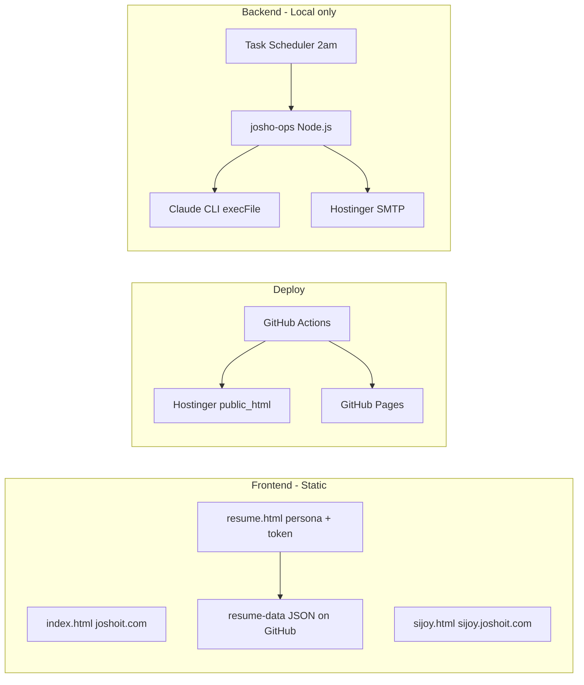

# Reliability and India AI Compute Roadmap

## Current scope (as-is)

- **Frontend:** Static HTML (index, sijoy, resume), no build step. Data: GitHub raw JSON for resume personas.
- **Backend:** [josho-ops/agents/orchestrator.js](josho-ops/agents/orchestrator.js) runs on your Windows machine at 2am via Task Scheduler; it shells out to `claude` CLI; email via Hostinger SMTP. No always-on server.

---

## Part 1: Making the portal more reliable

### Frontend reliability

| Area                        | Current                                             | Improvement                                                                                                                                                                                                                                                          |
| --------------------------- | --------------------------------------------------- | -------------------------------------------------------------------------------------------------------------------------------------------------------------------------------------------------------------------------------------------------------------------- |
| **Hosting**                 | Hostinger (single server) + GitHub Pages            | Keep as primary; add a CDN (e.g. Cloudflare in front of Hostinger) for caching, DDoS mitigation, and optional SSL/redirects.                                                                                                                                         |
| **Resume data**             | Fetched from `raw.githubusercontent.com` in browser | Add cache headers or a small proxy so GitHub outages don’t break resume; alternatively host JSON in repo and deploy with site (already possible if you copy `resume-data/` to Hostinger).                                                                            |
| **Single point of failure** | One Hostinger account                               | Document and occasionally test “failover”: GitHub Pages already serves the same repo; you can point a backup domain or subdomain to Pages so the site is viewable if Hostinger is down.                                                                              |
| **Monitoring**              | None                                                | Add a simple uptime check (e.g. UptimeRobot, Better Uptime) for `joshoit.com` and `sijoy.joshoit.com` with email/SMS on failure.                                                                                                                                     |
| **Errors**                  | No global handler                                   | In [resume.html](resume.html), wrap the main flow in try/catch and show a friendly “Something went wrong” + retry instead of a blank page. Optional: a tiny client-side error beacon (e.g. to a serverless function or form endpoint) for 4xx/5xx or fetch failures. |

No need to move to React/Next for “reliability” unless you also want a different architecture (SSR, API routes). Reliability gains come from CDN, monitoring, and graceful error handling.

### Backend (josho-ops) reliability

| Area                 | Current                                | Improvement                                                                                                                                                                                                                                                                    |
| -------------------- | -------------------------------------- | ------------------------------------------------------------------------------------------------------------------------------------------------------------------------------------------------------------------------------------------------------------------------------ |
| **Where it runs**    | Your PC at 2am                         | Same for now; document that the pipeline depends on the machine being on and connected. Optional later: run the same Node script on a small VPS or a GitHub Actions cron so it’s not tied to your laptop.                                                                      |
| **Failure handling** | Logs to file; morning email on success | Already reasonable. Add: (1) send a short “pipeline failed” email when any phase errors (reuse [morning-review.js](josho-ops/agents/morning-review.js) or a small notifier script), (2) retry once for transient failures (e.g. network, rate limit) with exponential backoff. |
| **Secrets**          | `.env` local only                      | Keep env vars out of repo. If you later run on a server, use the platform’s secret store (e.g. GitHub Actions secrets, VPS env file with restricted permissions).                                                                                                              |
| **Idempotency**      | Agents can overwrite files             | Ensure critical steps (e.g. “send this email once”) are idempotent or guarded (e.g. “only send if not already sent today”); avoid duplicate sends on retry.                                                                                                                    |

Implementing the “failure email” and one retry with backoff in the orchestrator would give the biggest reliability gain for the current setup.

---

## Part 2: Using India AI compute for cheap models and agents

### What’s available (India, 2025–2026)

- **IndiaAI Mission:** ~38,000 GPUs (including H200, H100) at **Rs 65–92/hour** for eligible startups/MSME/academia; subsidies up to 40%; access via empaneled providers.
- **Private:** Yotta (Shakti Cloud), ZenoCloud (e.g. **₹49/hr L4**, H100/H200 at higher rates). ZenoCloud and similar give per-hour GPU rental without going through the government portal.

So you have two tracks: (1) apply for IndiaAI Mission if you qualify, or (2) use a commercial Indian GPU host (Yotta, ZenoCloud, etc.) for on-demand or reserved capacity.

### How to use it for your agents

Right now, agents use the **Claude API via `claude` CLI** (Anthropic). To “use India AI farms” you’d be running **your own or open models on GPUs** in India, not replacing the Claude API call with a single line—you’d introduce an inference layer.

High-level options:

**Option A – API in front of India GPU (recommended path)**  

- Rent a GPU instance (e.g. ZenoCloud L4/H100 or IndiaAI-eligible GPU) in India.  
- On that instance, run an inference server (e.g. vLLM, Ollama, or a small FastAPI/Flask app) that loads one or more open models (Llama, Mistral, Qwen, etc.).  
- Expose an HTTP API (e.g. OpenAI-compatible) so your code can `POST` prompts and get completions.  
- In josho-ops, add a “model client” that can call either Claude (existing) or this India-hosted endpoint (e.g. via a config flag or env var).  
- Use India GPU for high-volume or non-critical tasks (e.g. first-pass content, summarization); keep Claude for tasks where you want maximum quality or strict safety.

**Option B – Move entire agent runtime to India**  

- Run the Node orchestrator on a VPS in India (same or same region as the GPU).  
- Orchestrator calls local inference API (as in A).  
- Reduces latency and keeps data in India; good if you want to minimize US API usage and are okay operating a small server.

**Option C – Hybrid**  

- Keep overnight pipeline on your PC or a US VPS, but have one or more “worker” agents that call an India-hosted model API (as in A).  
- E.g. “content-creator” uses India Llama; “analyst” and “email-automator” keep using Claude.

### Concrete steps to “utilize India AI and keep building agents”

1. **Choose provider and GPU**
  - Apply for IndiaAI Mission if you’re eligible, or sign up with ZenoCloud / Yotta.  
  - Start with a single GPU (e.g. L4 or small H100 slice) to validate cost and throughput.
2. **Stand up inference API**
  - On the GPU VM: install CUDA, then vLLM (or Ollama).  
  - Pull an open model (e.g. Llama 3.1 8B or 70B depending on GPU).  
  - Expose an HTTP API (vLLM has built-in OpenAI-compatible server; or wrap Ollama in a thin FastAPI that your agents will call).
3. **Abstract “model” in josho-ops**
  - Introduce a small module, e.g. `agents/model-client.js`, that:  
    - Reads config (e.g. `USE_INDIA_LLM=true`, `INDIA_MODEL_URL=https://your-gpu-server/inference`).  
    - For each agent run, either:  
      - call Claude via existing `claude` CLI, or  
      - call the India endpoint with the same prompt and return the completion in a format the rest of the pipeline expects.
  - No need to rewrite all agents at once; switch one agent (e.g. content-creator) to the India model first.
4. **Keep building agents**
  - New agents can be added to [agent-config.json](josho-ops/agents/agent-config.json) and new phases in the orchestrator.  
  - Each new agent can be wired to “Claude” or “India model” in the model-client so you can balance cost (India) vs quality (Claude).
5. **Cost and scaling**
  - Track cost per run (GPU hours × rate).  
  - If usage grows, consider reserved/spot instances or moving more agents to the India model.  
  - Optionally run the GPU only during a “batch window” (e.g. 2am–5am India time) to align with your overnight pipeline and minimize hours.

---

## Summary

- **Reliability (frontend):** CDN in front of Hostinger, uptime monitoring, resume data strategy (deploy with site or cached), and basic error handling/beacon in resume.html.  
- **Reliability (backend):** Failure notification email, one retry with backoff, and optional move of the orchestrator to a VPS or GitHub Actions cron for independence from your PC.  
- **India AI:** Use India GPU (IndiaAI or ZenoCloud/Yotta) to run an open model behind an HTTP API, then add a model-client in josho-ops that can call either Claude or this API so you can run more agents and more volume at lower cost while keeping Claude where it matters most.

If you tell me your priority (e.g. “first: failure email + retry” or “first: India GPU API design”), I can break that part into a step-by-step implementation plan next.